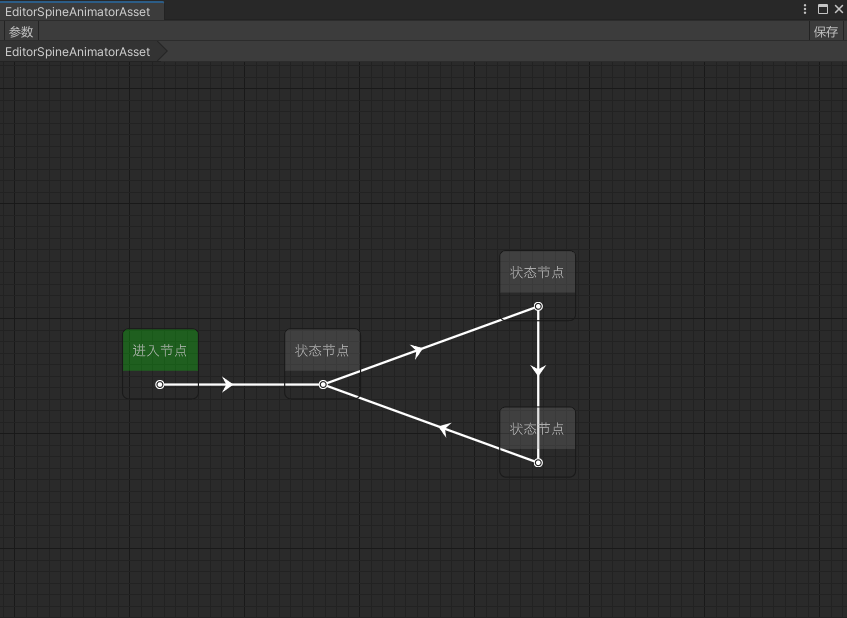

# Emilia-StateMachine

Emilia-StateMachine是基于Emilia-NodeEditor实现的状态机节点编辑器

# 特点

运行时和编辑器分离  
组件式状态机  
可视化调试  
热重载  
子状态机实现  

# 安装
Unity版本：2021.3+  
Odin版本：3.1.2+  

### Odin为付费插件请自行导入

### 使用unitypackage安装  

在Tag界面中选择对应版本  [Tag界面](https://github.com/CCEMT/Emilia-StateMachine/tags)  
找到.unitypackage文件进行下载  
导入Unity之后在PackageManager界面中安装Editor Coroutines  

### 使用Unity Package Manager安装  

打开Packages/manifest.json

将以下内容添加进manifest文件中

~~~
"com.emilia.kit": "https://github.com/CCEMT/Emilia-Kit.git?path=Assets/Emilia/Kit",
"com.emilia.node.editor": "https://github.com/CCEMT/Emilia-NodeEditor.git?path=Assets/Emilia/Node.Editor",
"com.emilia.statemachine": "https://github.com/CCEMT/Emilia-StateMachine.git?path=Assets/Emilia/StateMachine"
~~~

# 例子

基于Emilia-StateMachine实现Spine的动画状态机 [SpineAnimator](https://github.com/CCEMT/Emilia-SpineAnimator)  

# 开始

以下为例子中的实现

### 创建编辑器文件

~~~
[CreateAssetMenu(menuName = "Emilia/SpineAnimator/EditorSpineAnimatorAsset", fileName = "EditorSpineAnimatorAsset")]
public class EditorSpineAnimatorAsset : EditorStateMachineAsset
{
    public SkeletonDataAsset skeletonDataAsset;
        
    public override string outputFilePath => "Assets/Emilia/SpineAnimator/Resource/Config";
    public override Type[] stateComponentSubTypes => new[] {typeof(ISpineAnimatorComponentAsset), typeof(IUniversalComponentAsset)};
    public override Type[] conditionSubTypes => new[] {typeof(ISpineAnimatorConditionAsset), typeof(IUniversalConditionAsset)};
}

~~~

outputFilePath 运行时文件最终保存的路径  
stateComponentSubTypes 状态组件的基类，用于状态中创建组件时的过滤菜单  
conditionSubTypes 条件的基类，用于转换中创建条件时的过滤菜单  

### 创建状态组件基类

~~~
public interface ISpineAnimatorComponentAsset { }

public abstract class SpineAnimatorComponentAsset<T> : StateComponentAsset<T>, ISpineAnimatorComponentAsset where T : class, IStateComponent, new() { }

public abstract class SpineAnimatorComponent<T> : StateComponent<T> where T : class, IStateComponentAsset
{
    protected SkeletonAnimation skeletonAnimation;

    protected override void OnInit()
    {
        base.OnInit();
        skeletonAnimation = this.owner as SkeletonAnimation;
    }
}
~~~

### 创建条件基类

~~~
public interface ISpineAnimatorConditionAsset { }

public abstract class SpineAnimatorConditionAsset<T> : ConditionAsset<T>, ISpineAnimatorConditionAsset where T : class, ICondition, new() { }

public abstract class SpineAnimatorCondition<T> : Condition<T> where T : class, IConditionAsset { }
~~~

### 运行

~~~
//创建加载器
StateMachineLoader stateMachineLoader = new StateMachineLoader();
stateMachineLoader.runtimeFilePath = "Assets/..";
stateMachineLoader.editorFilePath = "Assets/..";

//这里接入自己项目里面的加载API
stateMachineLoader.onLoadAsset = OnLoadAsset;

//这里是反序列化（如果修改了序列化方案则需要修改，这里默认使用Odin序列化）
stateMachineLoader.onLoadStateMachineAsset = (bytes) => SerializationUtility.DeserializeValue<StateMachineAsset>(bytes, DataFormat.Binary);

string fileName = "xx";//不带后缀的文件名

runner = StateMachineRunnerUtility.CreateRunner();
runner.Init(fileName, stateMachineLoader, skeletonAnimation);
~~~

### 生命周期
~~~
runner.Start();//开始运行
runner.Update();//更新
runner.Dispose();//停止运行
~~~

### 拓展

~~~
//组件的拓展
//StateMachineTitle为菜单项
//需要序列化保存的放进Asset中
//条件拓展也同理

[StateMachineTitle("播放动画"), Serializable]
public class PlayAnimationComponentAsset : SpineAnimatorComponentAsset<PlayAnimationComponent>
{
    [LabelText("动画名称"), SpineAnimationNameSelector]
    public string animationName;

    [LabelText("轨道")]
    public int trackIndex;

    [LabelText("是否循环")]
    public bool isLoop;
}

public class PlayAnimationComponent : SpineAnimatorComponent<PlayAnimationComponentAsset>
{
    public override void Enter(StateMachine.StateMachine stateMachine)
    {
        base.Enter(stateMachine);
        this.skeletonAnimation.AnimationState.SetAnimation(this.asset.trackIndex, this.asset.animationName, this.asset.isLoop);
    }
}
~~~

# 联系

email：1076995595@qq.com  
QQ群：956223592  
